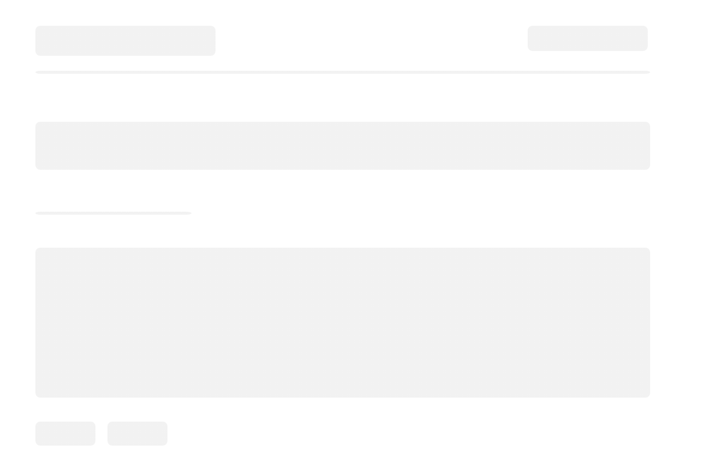
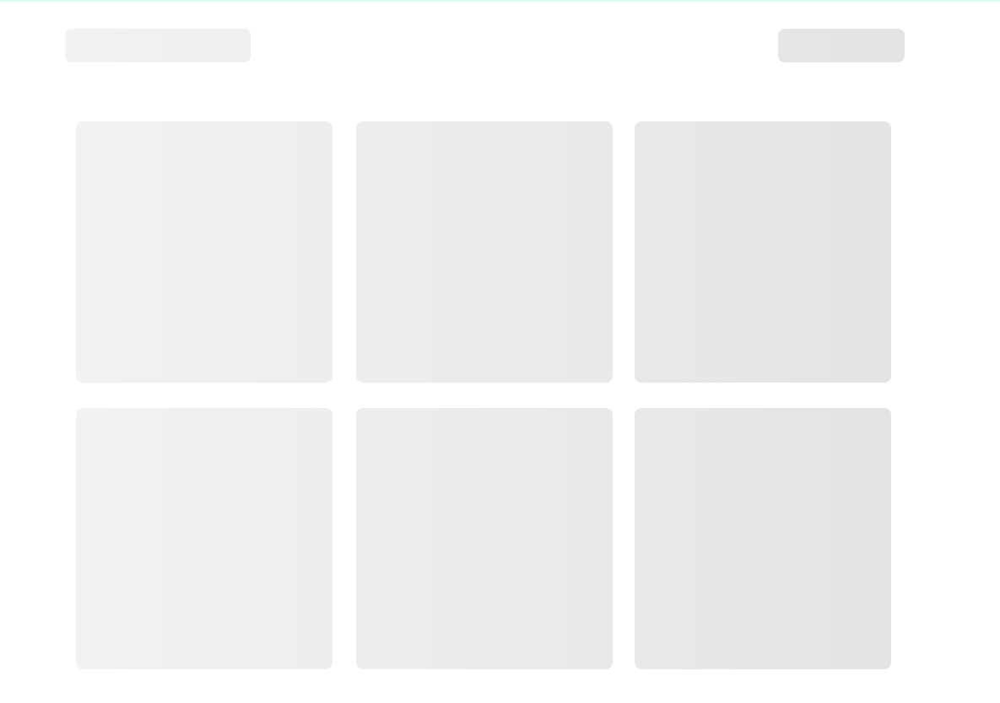
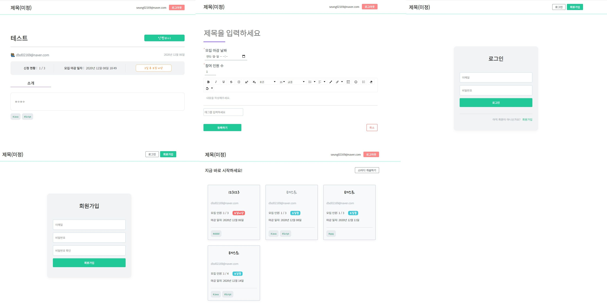

## 🚀 11주차 회고 및 개인 프로젝트 3주차 회고

### ✌️ 이번 주 개인 프로젝트를 진행하면서 배운 것, 한 것은?

- firebase의 firestore에서 아래와 같은 복합 쿼리를 사용할 때는 복합 색인을 등록해야한다.

```js
const response = firebase
  .firestore()
  .collection('groups')
  .where('tags', 'array-contains', tag)
  .orderBy('applyEndDate', 'asc')
  .get();
```

```json
// firestore.indexes.json
{
  "indexes": [
    {
      "collectionGroup": "groups",
      "queryScope": "COLLECTION",
      "fields": [
        {
          "fieldPath": "tags",
          "arrayConfig": "CONTAINS"
        },
        {
          "fieldPath": "applyEndDate",
          "order": "ASCENDING"
        }
      ]
    }
  ],
  "fieldOverrides": []
}
```

- [`react-content-loader`](https://github.com/danilowoz/react-content-loader)를 사용해서 Loading 페이지를 구현했다.
- SVG 기반으로 되어 있었고, 반응형으로도 해볼려했더니 너무 복잡해지는 거 같아서 포기. 일일히 잡아줘야하는 거 같다.

- 소개 페이지



- 메인 페이지



- 우선순위에서 좀 밀렸던 전체적인 CSS를 잡아주었다.
- CSS를 잡는일은 역시 시간상으로 오래걸리는 작업인거 같다..



- [React.memo](https://ko.reactjs.org/docs/react-api.html#reactmemo)를 사용했다.
- 컴포넌트가 동일한 `props`로 **동일한 결과를 렌더링**해낸다면, `React.memo`를 호출하고 결과를 메모이징(Memoizing)하도록 래핑하여 경우에 따라 성능 향상시킨다.

### ✌️ 느낀점!
- 코드숨도 마지막 한 주를 바라보고 있다. 😢 
- 거의 쉬지 않고 달리느냐고 힘들긴하지만 그만큼 배운 것이 너무 많다.
- 프로젝트 규모를 생각보다 크게 잡아서 처음 할려고 했던거보다 많이 진행되지 않았지만.. 마지막 주인 다음주까지 열심히 달려봐야겠다.
- 이번주는 기능적으로는 많이 추가를 못했다. 완성도를 높이기 위해 대부분 validation 체크 로직이나, CSS를 잡고, 사소한 에러들을 수정하는 일이 대부분이였다. 
- 가장 많이 시간을 투자한 CSS 작업은 공부가 더 많이 필요하다 느꼈다. 여전히 모르는 것들이 태반이고, `transition`이나 에니메이션은 세상 모르겠다 ㅎㅎ
- 프로젝트를 진행하고 함수형 자바스크립트 스터디를 진행하면서 코드숨이 끝나면 계속 이어나갈 공부들이 많이 보인다. 😤
- 그리고 스터디를 진행하면서 부족한 점이 너무 많다는 것을 느꼈고, 다른 분들을 보면서 동기부여가 많이 되어 좋다.
- 하지만, 너무 부족하기 때문에 쉬지 말고 공부를 계속 해야한다는 압박감이 너무 많이 든다. 꾸준히 지치지 말고 공부하자는 생각으로 시작했지만, 어느 정도가 꾸준히고 어느 정도의 시간을 투자한 공부가 지치지 않을 것인가는 아직 오리무중이다.
- 누가 뒤에서 쫒아오는거 같은 심리적 부담감은 떨치기가 힘들어서 뭘 해도 공부해야지 생각뿐이고, 해도 만족스럽지 못한 하루가 반복된다.
- 일단, 코드숨을 마친 후 퇴사를 하고 조금은 여유롭게 공부를 하며 취업 준비를 해야겠다.
- 급하게 생각하지말자. 늦었지만 그래도 너무 늦지 않았다! 아직 26살이면 충분히 어리다! 😤

### 🎯 진행사항
- [개인 프로젝트 3주차 계획](https://github.com/CodeSoom/project-react-2-saseungmin/issues/44)
- [GitHub 저장소](https://github.com/CodeSoom/project-react-2-saseungmin)
- URL 주소: https://sweet-1cfff.web.app/