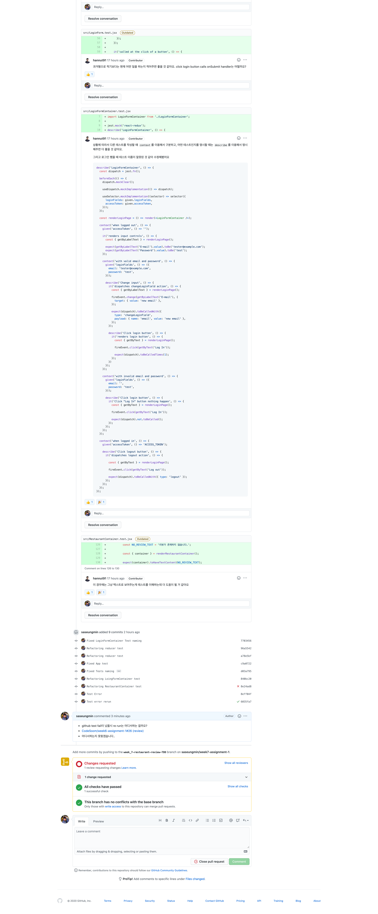

## 🚀 7주차 회고 및 코드리뷰 정리
- 7주차인 이번주는 로그인 기능과 리뷰를 작성하는 `POST`로 처리하는 기능을 구현하는 것이였다.
- 이번주 아샬님의 강의 영상의 길이가 긴 것을 보고 많은 시간이 필요할 것이라고 느꼈다.
- 하지만 더 많이 필요한 만큼 시간을 할애하지 못했다.
- 더 많은 시간을 투자하고 싶어도 회사일이 바빠서 하기가 쉽지 않았다.
- 이번주 PR은 화요일날 올렸지만, 과제를 완료한 것은 금요일에서 토요일 넘어가는 새벽이였다.
- 그래서 이번주는 리팩토링을 하지 못했다.
- 늦게 한 만큼 내 손해라는 것은 누구보다 잘 알고 있었지만, 그럴 수 없는 것이 아쉬웠다.
- 지금 과제하는 것도 꾸역꾸역? 히는 거 같은데 프로젝트 한 달을 잘 마무리 지을 수 있을까..?
- 그리고 지금 다니고 있는 회사를 퇴사하기로 마음먹었다. 지금 다니는 회사도 좋고, 사람들도 좋고 야근도 많지 않고 나쁘지 않다. 하지만, 나는 내가 하고 싶은 프론트앤드 개발자가 되고 싶다. 그게 전부다.

### ✌ 이번주에 받은 코드리뷰를 바탕으로 배운 것들은?
- `'입력이 안된 사항이 있습니다.'`는 [`Magic literal`](https://refactoring.com/catalog/replaceMagicLiteral.html) 이라는 것이라는 걸 알게 되었다.
- 하지만 테스트에서는 텍스트 그대로를 보여주는 것이 좋다.
- 윤석님의 [친절한 설명](https://github.com/CodeSoom/week7-assignment-1/pull/26#discussion_r516718860)이였다..
```jsx
const { container } = render(<ErrorMessage message={message} />);

expect(container).toHaveTextContent('입력이 안된 사항이 있습니다.');

// component
const ERROR_MESSAGE = '입력이 안된 사항이 있습니다.';

// 생략...
{error && <ErrorMessage message={ERROR_MESSAGE} />}
```

- 테스트의 설명? 이름?을 지는데에 있어서 고민이 많이 갔다.
- **테스트의 이름이 구체적인 구현 상항에 의존하면 안된다.**
- 구현이 조금만 바뀌어도 테스트 뿐만 아니라 테스트의 이름까지 변경될 가능성이 있다.
- 테스트가 **어떤 일을 하고 어떤 변화가 일어나는지에 대해서** 테스트의 이름을 지어보자.
- 또한, **과거형으로 이름을 짓기보단 현재 어떤 일을 하는지 적어주자.**
```jsx
// 변경 전
it('renders "Log In" button', () => {
  const { getByText } = renderLoginForm({ error });

  fireEvent.click(getByText('Log In'));

  expect(handleSubmit).toBeCalled();
});

// 변경 후
it('click login button calls onSubmit handler', () => {
  const { getByText } = renderLoginForm({ error });

  fireEvent.click(getByText('Log In'));

  expect(handleSubmit).toBeCalled();
});
```

- **상황에 따라서 다른 테스트를 작성할 때**는 `context`를 이용하여 구분하고, **어떤 테스트인지를 명시할 때**는 `describe`를 이용해서 명시해준다.
- 윤석님의 자세한 [코드리뷰](https://github.com/CodeSoom/week7-assignment-1/pull/26#discussion_r519193846)였다.

### 🤔 이어서 느낀점은??
- 이번주 받은 코드리뷰는 대부분 테스트에 관한 리뷰였다.
- 확실히 아직도 많이 부족한 거 같고, 테스트 이름을 짓는데에 있어서 좀 더 많은 고민을 해볼 필요가 있다.
- 그리고 전에 받았던 코드리뷰의 지적사항들을 이번에도 같은 사항으로 또 받았다. 아직 익숙치 않거나 당연하게 받아들이지 않아서 인지 자꾸 놓치게 되는거 같다.
- 프로젝트 때 뭘 해야할지 아직도 정하지 못했다. 뭐를 하면 좋을까? 흠.. 난 왜 이렇게 아이디어가 없는건지..
- 저번 주와 비교했을 때 이번 주는 만족스럽지 못한 주였다.
- 할 껀 많았지만 마음처럼 쉽게 되는 건 없다. 하지만, 노력은 해야겠지?
- 한 주 한 주가 너무 빠르게 흐른다 그렇기 때문에 다음주도 열심히 달려봐야겠다. 😤
- 다다음달?에 퇴사를 하면 지금 시간이 부족하다고 느껴지는 부분을 채워 공부를 더 많이 하고 싶다.

### 📚 참고 사항
#### 🎈 [httpie](https://httpie.io/)
- HTTP 클라이언트 CLI 도구입니다. 간단한 데이터 조회 및 전송을 테스트해볼 수 있다.

#### 🎈 [Authorization 헤더](https://developer.mozilla.org/ko/docs/Web/HTTP/Headers/Authorization)
- HTTP Authorization 요청 헤더는 유저 에이전트에서 서버에 인증정보를 전달하기 위해 사용된다.
- https://developer.mozilla.org/en-US/docs/Web/HTTP/Authentication

#### 🎈 [LocalStorage](https://developer.mozilla.org/ko/docs/Web/API/Window/localStorage)
- LocalStorage는 브라우저에 데이터를 저장하기 위해 사용된다.
- localStorage는 저장된 데이터의 만료기간이 없고, key와 value는 항상 문자열로 저장된다.
- [SessionStorage](https://developer.mozilla.org/ko/docs/Web/API/Window/sessionStorage)

#### 📌 7주차 받은 코드리뷰1


#### 📌 7주차 받은 코드리뷰2

