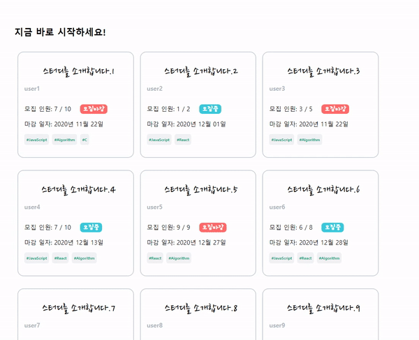

## 🚀 9주차 회고 및 개인 프로젝트 1주차 회고
- 코드숨 마지막 3주가 남았고, 이번 주부터 개인 프로젝트를 시작했다.
- [개인 프로젝트](https://github.com/CodeSoom/project-react-2-saseungmin)는 스터디를 모집하고 커뮤니케이션 할 수 있는 것을 만들려고 한다!😤 ([이슈 참고](https://github.com/CodeSoom/project-react-2-saseungmin/issues/1) )
- 회사는 여전히 프로젝트 마무리 단계라 여전히 바쁘고, 코드숨 또한 말할 거 없이 더욱 바빠졌다!
- 그래서 이번 주부터는 잠을 한시간 더 줄였다. 
- 코드숨이 끝날 때까지 퇴근 후 2시까지 공부하기를 마음을 먹었다. 그리고 월, 화, 수가 지나가고 목, 금이 왔는데 진짜 몽롱한 기분이.. 
- 회사에서 졸아버리고 금요일은 너무 졸려서 점심도 거르고 점심 시간에 잠을 잤다. 왜 이렇게 잠이 많고, 채력이 떨어진건지..ㅎㅎ
- 개인 프로젝트를 진행하면서 일단 이번주는 예정대로 진행은 된거 같지만, 남은 3주 동안 마무리를 할 수 있을까는 아직도 의문형이다.

### 🤔 배운 것은?
- `webpack` 설정에 미숙했는데 점점 알아가고 있는 거 같다. 아직도 한참 부족하지만 웹팩도 알아야한다. 하나씩 알아가보자.
- 이번 주는 개인 프로젝트를 통해 이슈와 PR을 통해 진행되고 셀프 코드 리뷰와 회고를 통해 하나씩 배우는 것들이 많다.
- `axios` 테스팅하는 법을 알았다.
  - https://jestjs.io/docs/en/mock-functions#mocking-modules
  - https://www.npmjs.com/package/axios-mock-adapter
```javascript
describe('api', () => {
  describe('getStudyGroups', () => {
    beforeEach(() => {
      axios.get.mockResolvedValue({ data: STUDY_GROUPS });
    });

    it('returns study groups', async () => {
      const groups = await getStudyGroups();

      expect(groups).toEqual(STUDY_GROUPS);
    });
  });
});
```
- [`json-server`](https://github.com/typicode/json-server)를 사용하여 가짜 서버를 만들어서 api를 통신하는 방법을 배웠다.
- [react-moment](https://www.npmjs.com/package/react-moment)와 [moment.js](https://momentjs.com/)를 사용하여 실시간으로 변경되게 만들기.
이 부분에서 Hooks에서 setInterval를 사용하면 발생하는 [문제점](https://overreacted.io/making-setinterval-declarative-with-react-hooks/) ([이슈](https://github.com/CodeSoom/project-react-2-saseungmin/issues/9#issuecomment-731211330))

### 😢 아쉬운 점은?
- 이번 주는 매일 같이 하던 책을 읽고 정리를 못했다.
- [You Don't Know JS](https://github.com/saseungmin/reading_books_record_repository/tree/master/You%20Don%E2%80%99t%20Know%20JS%201)를 읽고 있는데 이번주는 책을 손도 못댔다.
- 그렇게 더욱 자세히 배우고 싶었던 스코프와 클로저에 관한것인데 조금씩이라도 읽어야할텐데.. 
- 코드숨 개인 프로젝트에 너무 올인하고 있는거 같은점? 하지만 일단 이게 제일 우선순위이다.


### 🎯 진행 사항


